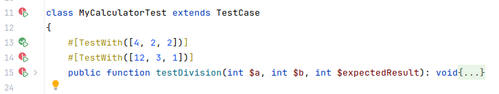

# Testing consecutive calls to the same method

## The old way with PHPUnit
Given that:
1) "`withConsecutive()` has been removed in PHPUnit 10" (see [here](https://github.com/sebastianbergmann/phpunit/issues/5063));
2) CakePHP has implemented its own replacement, (see [here](https://book.cakephp.org/5/en/appendices/phpunit10.html#withconsecutive-has-been-removed)).

```php
public function testDivision(): void
{
    $MyCalculator = $this->getMockBuilder(MyCalculator::class)
        ->onlyMethods(['isDivisionByZero'])
        ->getMock();

    $MyCalculator
        ->expects($this->exactly(2))
        ->method('isDivisionByZero')
        ->with(
            ...self::withConsecutive([2], [3])
        )
        ->willReturnOnConsecutiveCalls(false, false);

    $this->assertSame(2, $MyCalculator->division(4, 2));
    $this->assertSame(4, $MyCalculator->division(12, 3));
}
```

## The new way with Mockery
```php
public function testDivision(): void
{
    $MyCalculator = \Mockery::mock(MyCalculator::class . '[isDivisionByZero]');
    $MyCalculator->shouldAllowMockingProtectedMethods();
    $MyCalculator->shouldReceive('isDivisionByZero')->once()->with(2)->andReturnFalse();
    $MyCalculator->shouldReceive('isDivisionByZero')->once()->with(3)->andReturnFalse();

    $this->assertSame(2, $MyCalculator->division(4, 2));
    $this->assertSame(4, $MyCalculator->division(12, 3));
}
```
Notice that by doing this:
- everything is much more readable, significantly;
- the code is better overall;
- I have more control over each of the calls.

## The best way: Mockery + `TestWith` attribute
The previous case can be improved further.
Here I have 1 test and 4 assertions (for 2 calls to the same method).
If one of the 2 calls fails, the entire test fails, and it is not immediately clear why some parameter failed.

PHPUnit provides the `TestWith` attribute ([documentation](https://docs.phpunit.de/en/10.5/attributes.html#testwith)).

So I rewrite my testing method:
```php
#[TestWith([4, 2, 2])]
#[TestWith([12, 3, 4])]
public function testDivision(int $a, int $b, int $expectedResult): void
{
    $MyCalculator = \Mockery::mock(MyCalculator::class . '[isDivisionByZero]');
    $MyCalculator->shouldAllowMockingProtectedMethods();
    $MyCalculator->shouldReceive('isDivisionByZero')->once()->with($b)->andReturnFalse();

    $this->assertSame($expectedResult, $MyCalculator->division($a, $b));
}
```
This now still produces 4 assertions, but 2 separate tests.
The arguments used for each of the 2 tests are independent, better readable. Also, if one of the two tests were to fail, it is easier to understand which of the two, the other would still pass.

Now I modify an argument to intentionally fail one of the 2 tests:
```
#[TestWith([12, 3, 1])]
```

Partial output (as you can see, only one test is marked as failed and the arguments that caused the failure are given):
```
There was 1 failure:

1) MyCalculatorTest::testDivision with data set #1 (12, 3, 1)
Failed asserting that 4 is identical to 1.

FAILURES!
Tests: 2, Assertions: 3, Failures: 1.
Process finished with exit code 1
```

Also note how PhpStorm diplays the same thing on the screen:


## `TestWith` vs `DataProvider`
In addition to `TestWith`, PHPUnit also provides the `DataProvider` attribute ([documentation](https://docs.phpunit.de/en/10.5/attributes.html#dataprovider)).

I noticed that `DataProvider` is already widely used. However, `TestWith` should always be preferred because:
1) the parameters are better "bound" to the test code, i.e. indicated together with its declaration (and not with a method in itself);
2) it is more readable and requires less documentation;
3) it is also read better by IDEs.

However, `DataProvider` remains preferable in some limited cases:
1) when the same set of arguments is used by several different test methods (so as to declare them only once);
2) when the arguments are dynamic or the result of calls to different methods.

For example, with `TestWith` I can do this:
```php
#[TestWith([new DateTime()])]
#[TestWith([new DateTime('tomorrow')])]
public function testOnSomeArguments($DateTimeInstance): void
{
}
```

However, **I can't do either of these**:
```php
#[TestWith([DateTime::tomorrow()])]
#[TestWith([new DateTime('tomorrow')->addHours(2)])]
```

Since these cases, in addition to instantiating an object, call methods, here I will necessarily have to use the `DataProvider` attribute.
```php
public static function testOnSomeArgumentsProvider(): array
{
    return [
        [new DateTime()],
        [new DateTime('tomorrow')],
        [DateTime::tomorrow()],
        [new DateTime('tomorrow')->addHours(2)],
    ];
}

#[DataProvider('testOnSomeArgumentsProvider')]
public function testOnSomeArguments($DateTimeInstance): void
{
}
```
